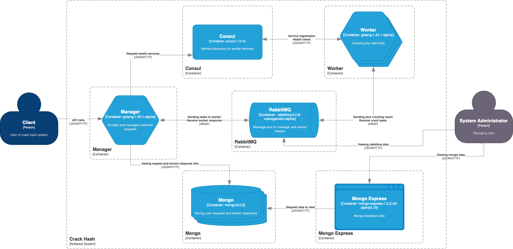

# CrackHash

CrackHash is a distributed system for cracking MD5 hashes using brute-force.

## Architecture



See [draw.io](assets/crackhash.drawio) scheme.

## Technologies
*	**Go**: Main language of implementation.
*	**MongoDB**: Storage of request states.
*   **Consul**: Service discovery.
*	**RabbitMQ**: Communication between the manager and workers.
*	**Docker & Docker Compose**: Container orchestration.

## Prerequisites
* Docker and Docker Compose must be installed.

## How to Run
1.	Clone the repository.
2.	In the project root, execute:
```shell
docker-compose up -d --force-recreate --build
```

## Docs

See [Manager](manager/README.md) and [Worker](worker/README.md).